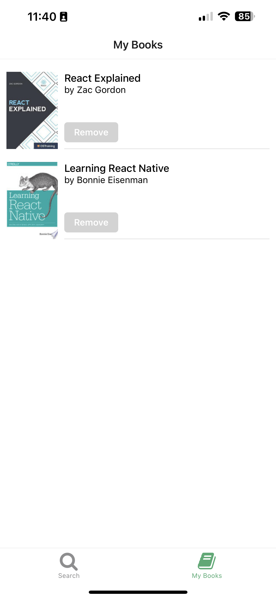

# About BooksMobile

[BooksMobile](https://www.youtube.com/live/-qAhg4EDIwQ?feature=share) is a tutorial Project done on a live stream by [notJust.dv](https://www.youtube.com/@notjustdev).

The App uses React Native with the Google Books API and the Open Library API to allow users to search for books and to add them to their own bookshelf.
For the Management of the Search Query we used [StepZen](https://stepzen.com/) to combine both APIs into one request and return.

### Features Build
 - Search Screen
   - Search Component
     - Reaches out to API via [Apollo for React Native](https://www.apollographql.com/)
 - Book Component
   - Add and Remove Books from My Books
 - My Books Component
   - Book List with [Async Storage](https://react-native-async-storage.github.io/async-storage/)
 

    
    

