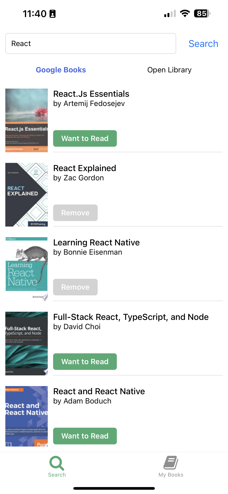

# About BooksMobile

[BooksMobile](https://www.youtube.com/live/-qAhg4EDIwQ?feature=share) is a tutorial Project done on a live stream by [notJust.dv](https://www.youtube.com/@notjustdev).

The App uses React Native with the Google Books API and the Open Library api to allow users to search books and to add them to their own bookshelf.

